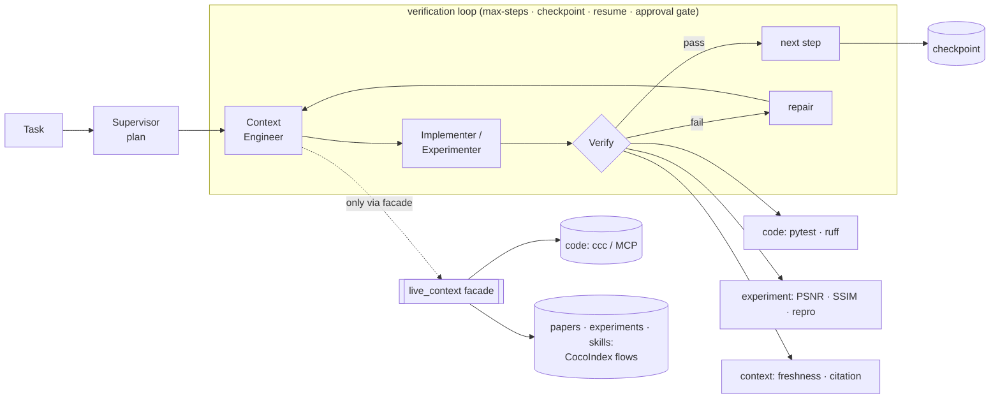

# Long-Horizon Research Agent

A verification-first agent harness. Every step is checked by an objective oracle —
a real test run, an image metric, a reproducibility re-run — and the agent only
advances when the check passes.


Long-horizon agents fail because errors compound. If each step succeeds with
probability `p`, an `n`-step task succeeds with probability about `pⁿ`, so even a
strong model drifts as the task gets longer. Asking the model to check its own work
raises `p` only a little — there is no external signal. This harness gates every
step on an objective verifier and advances only when the oracle passes:

- **code** — a real `pytest` run plus `ruff`; the change is reverted if it can't be verified.
- **experiment** — PSNR / SSIM recomputed from the output, plus a reproducibility re-run.
- **context** — freshness (is the index behind the source?) and citation (does every claim resolve to a source?).

A step that cannot be verified fails.

## Measured effect of the gate

[`lha ablate`](docs/ABLATION.md) runs a real LLM through the same harness under three
conditions and scores the identical first attempt under each, so the conditions differ
only in the gate:

Implementer `claude_cli` on `claude-haiku-4-5-20251001`, 17 bug-fix tasks × 3 reps
(51 paired cells per condition, 0 transient errors), graded by an independent final
scorer, not by the gate itself:

| condition | claimed | true success (95% CI) | false success (95% CI) |
|---|---|---|---|
| `trust` — apply the fix, no gate | 100% | 94% (88–100%) | 6% (0–12%) |
| `gate` — run the test gate, refuse on failure | 94% | 94% (88–100%) | 0% |
| `verify` — gate plus repair loop | 100% | 100% | 0% |

Without the gate, 3 of 51 accepted fixes are wrong and ship silently. `trust` and
`gate` score the same attempts, so the difference is exactly what the gate catches: it
refused those same 3 cells and discarded no correct fix (TN=3, FP=0, FN=0 against the
independent scorer). The repair loop then fixed all 3 refusals. The effect is real but
small at this corpus difficulty — haiku-4.5's first attempt is already right 94% of the
time here; the numbers say what the gate buys on top of that, no more. The experiment is
paired and leak-free (the implementer never sees the tests, a patch cannot touch the
oracle); method, statistics, and limits are in [docs/ABLATION.md](docs/ABLATION.md),
raw data in [benchmarks/ablation_report.json](benchmarks/ablation_report.json).

## The loop



The rest of the system reaches indexed context only through the `live_context`
facade (`search_code` / `search_papers` / `search_experiments` / `search_skills` /
`get_fresh_context` / `reject_stale`); CocoIndex and the code indexer live entirely
behind it, and a `grep` check keeps them there.

## Quickstart

```bash
uv sync                                        # install (Python 3.11+)
uv run lha run data/tasks/fix_average.yaml     # find a bug, fix it, verify with real pytest
uv run lha eval                                # run the self-eval across all five workflows
```

Run from the repo root. `uv sync && uv run lha eval` reproduces `5/5` from a clean
checkout (generated indexes and runs are gitignored and rebuilt on demand); the first
`lha eval` downloads a small embedding model (tens of MB, one-time) for the
paper/experiment/freshness cases.

The default implementer is a deterministic stub, so a real `pytest` verifies a real
fix with no API key and no network. Swap in an LLM with `--llm claude_cli` (the
authenticated `claude` CLI) or `--llm anthropic`.

## Self-eval

`lha eval` is the harness checking itself: five workflows, each with an objective
pass/fail. Output from this repo:

```
# Self-eval — 5/5

| dimension              | case                    | result | detail |
|------------------------|-------------------------|--------|--------|
| issue-to-PR            | fix_average             | PASS   | status=DONE verified=True |
| resume                 | pause_resume            | PASS   | first=PAUSED resumed=DONE |
| freshness              | edit_reindex            | PASS   | initial_fresh=True stale_after_edit=True fresh_after_reject=True |
| paper-to-experiment    | bicubic_sr              | PASS   | status=DONE verified=True |
| verification-ablation  | strict_threshold_caught | PASS   | status=FAILED psnr_correctly_rejected=True reached_psnr_step=True |

score: 5/5
```

Reproduce with `uv run lha eval`. In the verification-ablation case, the bicubic
baseline reaches PSNR ≈ 25.07 dB / SSIM ≈ 0.8246 (recomputed by the verifier with
`data_range=1.0`), so when the task asks for a 40 dB bar the harness reports `FAILED`
instead of claiming a result it cannot verify.

## How it works

- **The loop.** `context → execute → verify → repair → checkpoint → repeat`, with
  max-steps, durable checkpoint/resume, and a human-approval gate. State is a JSON
  checkpoint plus an append-only `ledger.jsonl`.
- **Structured artifacts.** Each role emits a typed artifact: Supervisor →
  `Plan`, Context Engineer → `ContextBundle` (with provenance), Implementer → `Patch`,
  Verifier → `Verdict`.
- **Three verifier families behind one interface.** `code` (`pytest`, `ruff`),
  `experiment` (`psnr`, `ssim`, `reproducibility`), `context` (`freshness`,
  `citation`). The core has no metric-specific assumptions, and a verifier that
  cannot run its check fails.
- **Live context, isolated.** Code search goes through `ccc` (cocoindex-code) over
  its MCP tool; paper/experiment/skill context comes from CocoIndex flows. All of it
  sits behind the `live_context` facade.
- **Durable runtime (opt-in).** `lha run --runtime langgraph` drives the same plan
  through a LangGraph `StateGraph` checkpointed by `SqliteSaver`, using `interrupt()`
  for the approval gate.
- **Skill memory.** A verified run is distilled to a retrievable note and surfaced as
  context for later tasks. Only verified successes are recorded.

## Design notes

Most agent frameworks orchestrate tool calls and, if they evaluate at all, use an LLM
as judge. This harness inverts that: the loop is only as reliable as its verifier, so
the verifier is an objective oracle wherever one exists — a test suite, an image
metric, a freshness check — and the harness fails loudly when it cannot verify. The
core stays small and readable, with the live-context machinery quarantined behind a
facade, though the embedding/index stack pulls a GB-scale dependency set (torch,
cocoindex) on the first `uv sync`.

## Documentation

- [docs/QUICKSTART.md](docs/QUICKSTART.md) — clone to a verified run in a few minutes.
- [docs/VERIFICATION_FIRST.md](docs/VERIFICATION_FIRST.md) — why error compounding
  makes an objective oracle the highest-leverage place to intervene.
- [docs/ABLATION.md](docs/ABLATION.md) — the measured effect: a real LLM with
  verification off vs. on, and what the gate and the repair loop each buy.
- [docs/ARCHITECTURE.md](docs/ARCHITECTURE.md) — the loop, the facade, the verifier
  families, the durable runtime.
- [docs/BENCHMARKS.md](docs/BENCHMARKS.md) — the self-eval, what each case verifies,
  and how to reproduce `5/5`.

## CLI

```
lha run <task.yaml> [--runtime loop|langgraph] [--llm stub|claude_cli|anthropic]
lha resume <run_id>             lha approve|reject <run_id>    lha trace <run_id>
lha eval [--quick]              lha batch <task.yaml> ...      # parallel, process-isolated
lha ablate [task.yaml ...]      # verification ablation: trust vs gate vs verify (real LLM)
lha index <path>                lha index-docs                 lha ask <query> --kinds code,paper,...
```

`-v`/`--verbose` raises log verbosity; `lha trace <run_id>` renders a run's ledger
timeline. To run in a container, see [docs/DEPLOY.md](docs/DEPLOY.md).

## Requirements

- Python 3.11+, [`uv`](https://docs.astral.sh/uv/).
- `uv sync` installs the harness and its dependencies.
- Code search uses [`cocoindex-code`](https://github.com/cocoindex-io/cocoindex-code)
  (`pipx install 'cocoindex-code[full]'`, then `claude mcp add cocoindex-code -- ccc mcp`).
  The harness talks to its MCP `search` tool directly; the bundled demos run without it.

## Status

Everything from the walking skeleton to the durable runtime is implemented and
exercised by `uv run pytest` and `uv run lha eval`. This is a research and portfolio project, not a
production service. Run `lha eval` and the bundled demos from a source checkout — the
wheel ships the harness, while the benchmark fixtures under `data/` live in the repo.
