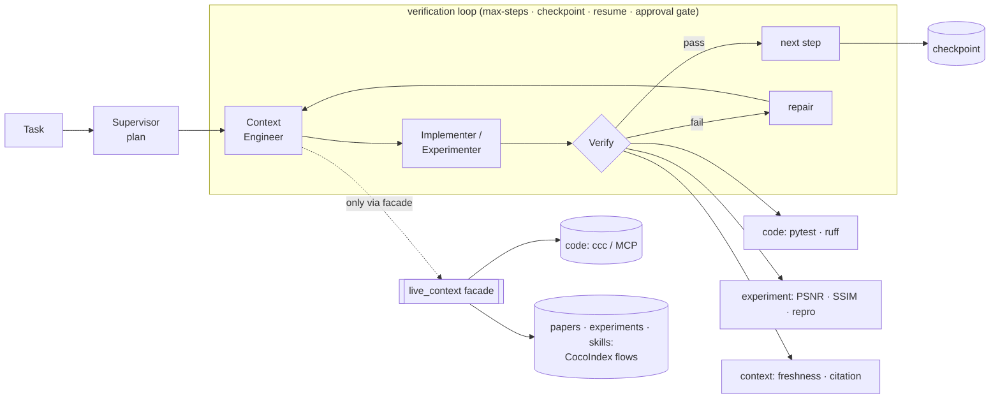

# Long-Horizon Research Agent

**A verification-first agent harness: every step is gated by an _objective oracle_
— real tests, PSNR/SSIM, reproducibility — not an LLM judging itself.**


Long-horizon agents fail because **errors compound**: at per-step reliability `p`
over `n` steps, end-to-end success scales like `pⁿ`, so even a strong model drifts
as tasks get longer. Asking the model to check its own work doesn't reliably break
the spiral — there's no external signal. This harness dampens compounding by
gating **every** step on an objective verifier and only advancing when the oracle
says so:

- **code** → a real `pytest` run + `ruff` (and the change is reverted if it can't be verified)
- **experiment** → PSNR / SSIM **recomputed from the output** + a reproducibility re-run
- **context** → freshness (is the index behind the source?) + citation (does every claim resolve to a source?)

The result is a loop you can trust to *refuse* unverifiable success — see the
[verification-ablation](#results-lha-eval) result, where the harness correctly
**fails** an experiment that cannot meet its metric bar.

## The spine



The rest of the system reaches indexed context **only** through the
`live_context` facade (`search_code` / `search_papers` / `search_experiments` /
`search_skills` / `get_fresh_context` / `reject_stale`); CocoIndex and the code
indexer live entirely behind it. A `grep` check enforces the boundary.

## Quickstart (30 seconds)

```bash
uv sync                                        # install (Python 3.11+)
uv run lha run data/tasks/fix_average.yaml     # find a bug, fix it, verify with REAL pytest
uv run lha eval                                # self-evaluate across all 5 workflows
```

Run from the repo root. `uv sync && uv run lha eval` reproduces `5/5` from a clean
checkout (generated indexes/runs are gitignored and rebuilt on demand); the first
`lha eval` downloads a small embedding model (~tens of MB, one-time) for the
paper/experiment/freshness cases.

The walking skeleton runs with a **deterministic stub** implementer, so a real
`pytest` verifies a real fix with no API key and no network. Swap in an LLM with
`--llm claude_cli` (uses the authenticated `claude` CLI) or `--llm anthropic`.

## Results (`lha eval`)

`lha eval` is the harness measuring itself — **ResearchAgentBench-Lite**, five
tasks each with an objective pass/fail. Output, verbatim, from this repo:

```
# ResearchAgentBench-Lite — 5/5

| dimension              | case                    | result | detail |
|------------------------|-------------------------|--------|--------|
| issue-to-PR            | fix_average             | PASS   | status=DONE verified=True |
| resume                 | pause_resume            | PASS   | first=PAUSED resumed=DONE |
| freshness              | edit_reindex            | PASS   | initial_fresh=True stale_after_edit=True fresh_after_reject=True |
| paper-to-experiment    | bicubic_sr              | PASS   | status=DONE verified=True |
| verification-ablation  | strict_threshold_caught | PASS   | status=FAILED psnr_correctly_rejected=True reached_psnr_step=True |

score: 5/5
```

Reproduce: `uv run lha eval`. The **verification-ablation** case is the point —
the bicubic baseline reaches **PSNR ≈ 25.07 dB / SSIM ≈ 0.8246** (recomputed by
the verifier with `data_range=1.0`), so when asked to clear a 40 dB bar the
harness reports `FAILED`: it refuses to claim a result it cannot verify.

## How it works

- **The loop (spine).** `context → execute → verify → repair → checkpoint → repeat`,
  with max-steps, durable checkpoint/resume, and a human-approval gate. State is a
  JSON checkpoint plus an append-only `ledger.jsonl`.
- **Structured artifacts, not chat.** Each role emits a typed artifact: Supervisor →
  `Plan`, Context Engineer → `ContextBundle` (with provenance), Implementer → `Patch`,
  Verifier → `Verdict` (`verify.json`).
- **Three verifier families behind one interface.** `code` (`pytest`, `ruff`),
  `experiment` (`psnr`, `ssim`, `reproducibility`), `context` (`freshness`,
  `citation`). PSNR is just one verifier among many — the core has no metric-specific
  assumptions, and a verifier that *can't* run a check fails rather than passing.
- **Live context, isolated.** Code search goes through `ccc` (cocoindex-code) via its
  MCP tool; paper/experiment/skill context comes from CocoIndex flows. All of it sits
  behind the `live_context` facade.
- **Durable runtime (opt-in).** `lha run --runtime langgraph` drives the same plan
  through a LangGraph `StateGraph` checkpointed by `SqliteSaver`, using `interrupt()`
  for the approval gate (run → `AWAITING_APPROVAL` → `lha approve` → `lha resume` → `DONE`).
- **Skill memory.** Verified successes are distilled to retrievable notes and surfaced
  as context for future tasks.

## Why it's different

Most agent frameworks orchestrate tool calls and, when they evaluate at all, use an
LLM as judge. This project's bet is the opposite: **the loop is only as reliable as
its verifier**, so the verifier is an *objective* oracle wherever one exists (a test
suite, an image metric, a freshness check), and the harness is built to fail loudly
when it can't verify. It's a small, readable, dependency-light core (no heavy agent
framework required) with the live-context machinery quarantined behind a facade.

## Documentation

- [docs/QUICKSTART.md](docs/QUICKSTART.md) — clone → verified run in a few minutes,
  with expected output.
- [docs/VERIFICATION_FIRST.md](docs/VERIFICATION_FIRST.md) — the thesis: why error
  compounding makes an objective oracle the highest-leverage lever.
- [docs/ARCHITECTURE.md](docs/ARCHITECTURE.md) — the spine, the facade, the verifier
  families, the durable runtime (with diagrams).
- [docs/BENCHMARKS.md](docs/BENCHMARKS.md) — ResearchAgentBench-Lite, what each task
  verifies, and how to reproduce `5/5`.
- [docs/demo.md](docs/demo.md) — script to record the terminal demo GIF.

## CLI

```
lha run <task.yaml> [--runtime loop|langgraph] [--llm stub|claude_cli|anthropic]
lha resume <run_id>             lha approve|reject <run_id>
lha eval [--quick]              lha batch <task.yaml> ...      # parallel, process-isolated
lha index <path>                lha index-docs                 lha ask <query> --kinds code,paper,...
```

## Requirements & install

- **Python 3.11+**, [`uv`](https://docs.astral.sh/uv/).
- `uv sync` installs the harness and its deps.
- Code search uses [`cocoindex-code`](https://github.com/cocoindex-io/cocoindex-code)
  (`pipx install 'cocoindex-code[full]'`, then `claude mcp add cocoindex-code -- ccc mcp`
  for the outer agent). The harness talks to its MCP `search` tool directly; the
  bundled demos run without it.

## Status

Walking-skeleton through durable-runtime are implemented and exercised by
`uv run pytest` and `uv run lha eval`. This repo is a portfolio/research artifact,
not a production service.
