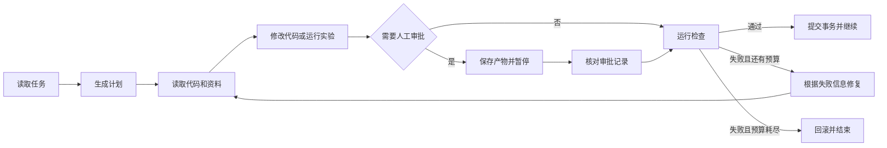

# LHA：代码任务的执行、恢复与校验

LHA 在独立工作目录中执行代码修改和实验任务。每一步都保存状态和证据；
检查通过后继续，失败时在预算内修复或回滚，进程中断后可以从已保存状态恢复。

[](https://github.com/liuqjjin/long-horizon-agent/actions/workflows/ci.yml)
[英文说明](https://github.com/liuqjjin/long-horizon-agent/blob/main/docs/README.en.md)

## 解决的问题

代码任务经常需要多轮读取、修改和验证。只保存模型最后一段回答，无法判断补丁是否
真正应用、检查是否完整执行，也无法在审批或进程中断后安全继续。

LHA 把这些工作交给运行器：

- 计划、步数、修复次数、时间和模型调用量随运行保存；
- 补丁写入前检查真实修改路径，写入后运行预先登记的检查；
- 需要人工确认时保存待审补丁，批准后核对同一份内容再继续；
- 检查失败时在预算内修复，证据损坏或检查无法运行时按失败处理；
- 消融实验使用独立评分器判定补丁，不把内部放行结果当作正确答案。

## 快速运行

需要 Python 3.11 或更高版本、`uv`，以及 Linux、macOS 或 WSL2。
原生 Windows 可通过 WSL2 或 Docker 运行。

```bash
git clone https://github.com/liuqjjin/long-horizon-agent.git
cd long-horizon-agent
uv sync

# 确定性示例，不需要模型凭据或 ccc
uv run lha run data/tasks/fix_average.yaml

# 运行仓库自测
LHA_RUNS_DIR=runs/_quickstart uv run lha eval
```

示例任务将代码索引设为可选，因此没有安装 `ccc` 也会执行 Pytest 和 Ruff。
其他任务可以把上下文声明为必需；索引不可用时，这类任务不会继续执行。

本机已经登录 Codex CLI 时，可以使用真实模型：

```bash
uv run lha --llm codex_cli run data/tasks/fix_average.yaml
```

命令默认使用当前 Codex CLI 配置。需要固定实验条件时，再把账户实际可用的模型和
推理强度写入 `LHA_CODEX_MODEL`、`LHA_CODEX_EFFORT`。

查看保存的状态、补丁和检查结果：

```bash
RUN_ID=替换为实际运行编号
uv run lha runs show "$RUN_ID"
uv run lha trace "$RUN_ID"
uv run lha trace "$RUN_ID" --html
```

## 执行流程



## 核心实现

### 状态与恢复

- `state.json` 带 SHA-256 校验，写入时先同步文件，再原子替换并同步目录。
- `ledger.jsonl` 保存事件链；每次更新先校验已有记录，再原子替换完整内容。
- 每个运行目录都有文件锁，用于拒绝并发恢复；稳定的尝试编号和幂等键用于避免重复写入
  审批、失败和完成事件。
- 恢复沿用创建运行时确定的步数、修复、时间和模型调用预算，不允许临时放宽。
- 可选的 LangGraph 运行时使用 SQLite 保存图状态，并复用同一套执行和校验代码。

### 补丁事务与审批

- `ResolvedPatch` 从实际差异或文件内容计算写入路径，不相信模型声明的文件列表。
- 测试、构建配置和持续集成文件默认受保护，例外路径必须由任务明确允许。
- `PatchTransaction` 记录 `PREPARED`、`APPLIED`、`VERIFIED` 和 `REVERTED`。
- 原文件、文件模式、摘要和冗余备份在补丁应用前保存；证据矛盾时停止恢复。
- 审批记录绑定步骤编号和补丁 SHA-256，恢复时不能用另一份补丁替换已审内容。

### 校验与执行

- 代码任务运行 Pytest、Ruff 或仓库适配器声明的命令。
- 实验任务从保存的数组重新计算指标，并在新目录中复跑。
- 未知检查、无法启动、没有收集到测试或全部跳过，都不计为通过。
- 目标代码通过统一的 `ExecutionBackend` 执行；外部仓库可使用禁网、限资源的 Docker 后端。
- Codex CLI 的 JSONL 输出按协议解析；格式错误、未知事件和未结束的工具调用都会失败。
- 代码与文档索引只通过 `lha.live_context` 访问，并保存来源摘要、新鲜度和不可用原因。

`data/long_tasks/` 还包含五个固定多文件用例，覆盖配置解析、SQLite 迁移、
并发异常、命令行约定和实验复现。它们用于测试状态转换和恢复，不作为外部榜单成绩。

## 已验证结果

### 内部校验消融

仓库中的消融报告是正式报告，实测模型为 `gpt-5.3-codex-spark`。
实验使用 17 个预设 Python 缺陷，每个任务重复 12 次，共 204 组。
计划执行 204 组，其中 204 组结果可用，ERROR 为 0 组；下表比例以
204 组可用结果为分母。

| 条件 | 处理方式 | 独立评分结果 |
|---|---|---|
| `trust` | 直接交付首轮补丁 | 201 个正确，3 个错误仍被接受 |
| `gate` | 检查后决定是否交付 | 接受 201 个正确补丁，拦截 3 个错误补丁；误放 0 个，误拒 0 个 |
| `verify` | 检查失败后允许有限修复 | 204/204 通过独立评分；错误交付 0 个，未交付 0 个 |

`trust` 与 `gate` 的错误交付差异采用按任务聚类的精确配对符号翻转检验，
p = 0.2500；`trust` 与 `verify` 的正确交付差异使用相同口径，p = 0.2500。
组合曲线只把实测任务成功率代入独立步骤模型，不增加样本，也不代表实际执行了
共享状态的长任务。原始证据见[评测证据目录](benchmarks/README.md)，
实验设计见[消融说明](docs/ABLATION.md)。

### Terminal-Bench 2.1 固定 20 题子集

已提交结果为 **7/20**：7 个 `PASS`、9 个 `FAIL`、4 个 `ERROR`，
四个 `ERROR` 保留在分母中。这是固定 20 题子集，不是完整数据集或排行榜成绩。

该评测在 Harbor 任务容器中直接运行 Codex，没有经过 LHA 的内部放行和修复流程；
它不能说明 LHA 拦截错误补丁或修复失败补丁的能力。协议和原始证据见
[评测说明](docs/BENCHMARKS.md)。

## 使用边界

- 项目用于研究和工程验证，不是多租户线上服务。
- `trusted-local` 适用于可信仓库，不能阻止目标代码访问当前用户有权访问的主机资源。
- Docker 隔离仍取决于镜像、挂载、网络、权限和资源限制。
- 总时限在持久化边界检查；每个阻塞操作仍需要独立超时。
- 已处理的退出路径会终止并确认原进程组后再清理临时凭据；主动脱离进程组的工具
  子进程不在宿主后端的强保证内，不可信工具必须使用 Docker 或其他外层隔离。
- `SIGKILL`、内核崩溃或断电可能绕过清理并留下权限受限的临时目录。
- 来源摘要和新鲜度检查不能替代可执行测试，测试通过也不代表覆盖所有输入。
- 无法校验的状态不会被当作成功；证据冲突时保留现场并停止恢复。

系统结构见[架构说明](docs/ARCHITECTURE.md)，完整发布检查见[部署说明](docs/DEPLOY.md)。
项目采用 MIT 许可证。
