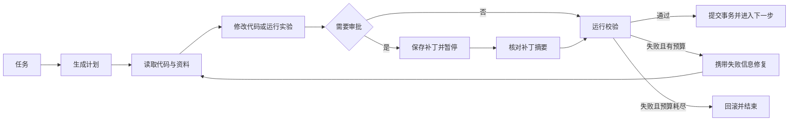

# LHA：可恢复的代码任务执行与校验框架

LHA 用来执行代码修改、实验和资料检索任务。模型产生结果后，框架运行独立检查；
检查通过才推进，失败信息会进入下一次修复。运行中断后可以从检查点继续。

[](https://github.com/liuqjjin/long-horizon-agent/actions/workflows/ci.yml)


[英文简版](https://github.com/liuqjjin/long-horizon-agent/blob/main/docs/README.en.md)

## 解决什么问题

多步骤代码任务最危险的情况不是命令报错，而是错误结果被当作成功继续使用。LHA 把
测试、静态检查、实验指标重算、索引新鲜度和人工审批放进同一个状态机：

```text
读取上下文 → 执行 → 审批（可选）→ 校验 → 修复或推进 → 保存检查点
```

内部校验只负责决定是否继续。消融实验的最终结果由另一套评分流程给出：它把补丁应用到
新的仓库副本，恢复原始测试，再独立执行评分，避免同一个检查既做决策又给自己打分。

## 如何运行

需要 Python 3.11+ 和 [uv](https://docs.astral.sh/uv/)。

```bash
git clone https://github.com/liuqjjin/long-horizon-agent.git
cd long-horizon-agent
uv sync

# 修复预先植入的错误，并运行真实 pytest
uv run lha run data/tasks/fix_average.yaml

# 执行六条端到端自测
uv run lha eval
```

默认使用确定性桩实现，不需要 API 密钥。也可以使用已经登录的命令行模型：

```bash
uv run lha --llm codex_cli run data/tasks/fix_average.yaml
uv run lha --llm claude_cli run data/tasks/fix_average.yaml
```

## 核心实现



### 补丁和审批

- 从实际 diff 或完整文件内容计算唯一写入路径，不信任模型声明的文件列表。
- 默认禁止修改测试、构建配置和 CI 文件；任务必须显式授权例外路径。
- 补丁采用 `PREPARED / APPLIED / VERIFIED / REVERTED` 事务状态。
- 每次尝试保存校验和、原文件备份和应用后摘要；恢复时发现不一致立即失败。
- 审批同时绑定步骤编号和补丁字节的 SHA-256，恢复时不能替换成人未看过的补丁。

### 状态和恢复

- `state.json` 使用 SHA-256 信封、`fsync` 和原子替换。
- `ledger.jsonl` 只追加写入；幂等键避免崩溃恢复产生重复完成事件。
- 步数、修复次数、运行时间和模型调用用量跨进程累计。
- 同一运行使用文件锁，两个进程不能同时恢复同一个沙箱。
- 可选 LangGraph 运行时使用 SQLite 保存图状态，并把执行、审批、校验拆成独立节点。

### 代码和实验校验

- 代码任务运行真实的 Pytest 和 Ruff；没有收集到测试、全部跳过或检查无法启动都算失败。
- 实验任务从保存的数组重新计算 PSNR、SSIM，不采信脚本自报指标。
- 复现实验使用新的临时目录，并核对输入、输出和数组摘要。
- 本地执行用于可信仓库；外部仓库应使用关闭网络并限制资源的 Docker 后端。

### 上下文

- 代码、论文、实验记录和已验证经验通过 `lha.live_context` 统一访问。
- 结果记录来源、内容摘要、索引版本和请求的数据类型。
- “没有命中”“后端不可用”“索引失败”和“内容过期”是不同状态。
- 修复阶段读取当前运行沙箱中的代码，不回读修改前的原仓库。

### 发布检查

```bash
uv run ruff check .
uv run pyright src/lha
uv run pytest -q
LHA_RUNS_DIR=runs/_release uv run lha eval
```

当前发布候选实测为 `523 passed, 3 skipped`，语句覆盖率 83%，端到端自测 6/6。
Docker 集成测试需要本机 Docker：

```bash
docker build -t lha:release .
LHA_DOCKER_TESTS=1 LHA_DOCKER_TEST_IMAGE=lha:release \
  uv run pytest tests/test_sandbox.py -q
docker run --rm lha:release lha --version
```

项目主要使用 Python 3.11、Pydantic、LangGraph、SQLite、Docker、Pytest 和 Ruff。
检索库与数值计算库属于局部实现，不作为系统架构的核心依赖来宣传。

## 已提交的实测结果

当前提交的是 schema v2 正式报告（formal）：Codex CLI 0.141.0 使用
`gpt-5.4-mini`、`low` 推理强度和只读沙箱生成补丁；最终评分在 Docker 中对新的
仓库副本运行原始测试，与内部检查相互独立。17 个预设 Python 缺陷，每个任务重复
12 次，共 204 组配对记录，`ERROR` 为 0。

| 条件 | 处理方式 | 独立评分 |
|---|---|---|
| `trust` | 直接接受首轮补丁 | 194 个正确，10 个错误仍被接受 |
| `gate` | 首轮补丁必须通过内部检查 | 接受 194 个正确补丁，拦截 10 个错误补丁 |
| `verify` | 检查失败后进入修复循环 | 204/204 通过独立评分 |

`trust` 与 `verify` 的 204 个配对单元有 10/0 个方向不一致，双侧精确 McNemar
检验为 `p = 0.001953125`，页面按五位小数显示为 `p = 0.00195`。

把同一次重复中的 17 个任务视为一个完整任务后，`trust` 完整成功 2/12，
`verify` 完整成功 12/12。组合曲线只是把每个任务的实测速率代入独立步骤模型的
描述性推演，不增加任何独立样本或观测，也不能当作新增长任务实验。

- [消融报告](https://github.com/liuqjjin/long-horizon-agent/blob/main/benchmarks/ablation_report.md)
- [原始记录与来源信息](https://github.com/liuqjjin/long-horizon-agent/blob/main/benchmarks/ablation_report.json)
- [完整任务与组合曲线](https://github.com/liuqjjin/long-horizon-agent/blob/main/benchmarks/horizon_report.md)
- [评测方法](https://github.com/liuqjjin/long-horizon-agent/blob/main/docs/ABLATION.md)

## 适用边界

- 这是研究和作品集项目，不是生产服务。
- `trusted-local` 不是针对恶意代码的安全沙箱。
- 上下文检查能验证来源和新鲜度，不能证明文本语义一定正确。
- 当前公开数字来自自建短任务；公开基准尚未发布成绩。
- 组合曲线不能替代真实执行的十步以上任务。

更多说明：[系统结构](https://github.com/liuqjjin/long-horizon-agent/blob/main/docs/ARCHITECTURE.md) · [快速开始](https://github.com/liuqjjin/long-horizon-agent/blob/main/docs/QUICKSTART.md) ·
[部署](https://github.com/liuqjjin/long-horizon-agent/blob/main/docs/DEPLOY.md) · [安全](https://github.com/liuqjjin/long-horizon-agent/blob/main/SECURITY.md) ·
[参与开发](https://github.com/liuqjjin/long-horizon-agent/blob/main/CONTRIBUTING.md)

MIT 许可证。
