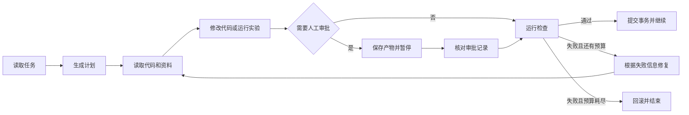

# LHA：代码任务的执行、恢复与校验

LHA 是一个面向代码修改和实验任务的执行器。它把任务拆成明确步骤，在每一步后运行
预先登记的检查；普通运行可从检查点恢复，正式消融按一次性实验处理。

[](https://github.com/liuqjjin/long-horizon-agent/actions/workflows/ci.yml)
[英文说明](https://github.com/liuqjjin/long-horizon-agent/blob/main/docs/README.en.md)

## 解决的问题

一次代码任务通常不止一轮模型调用。前一步的错误如果没有被发现，后续步骤会继续使用
错误结果。LHA 由执行器管理状态、预算、审批、检查、修复和回滚。

```text
读取上下文 → 执行 → 人工审批（可选）→ 校验 → 修复或推进 → 保存检查点
```

内部检查只决定当前运行能否继续。消融实验把保存的源码改动应用到新的仓库副本，
再运行固定测试；内部检查结果不作为实验真值。

## 快速运行

需要 Python 3.11 或更高版本、`uv`，以及 Linux、macOS 或 WSL2。
原生 Windows 尚未提供本项目要求的进程树回收保证，可改用 WSL2 或 Docker。

```bash
git clone https://github.com/liuqjjin/long-horizon-agent.git
cd long-horizon-agent
uv sync

# 默认使用确定性测试后端，不需要模型凭据或 ccc
uv run lha run data/tasks/fix_average.yaml

# 运行仓库自测
LHA_RUNS_DIR=runs/_quickstart uv run lha eval
```

这个入门任务把代码索引明确设为可选，因此没有安装 `ccc` 也会运行 Pytest 和 Ruff，
并保存完整校验证据。`ccc` 只是可选的代码索引功能；需要检索仓库上下文时再安装和启用。
其他任务若声明上下文为必需，索引不可用时仍会按失败处理。

本机已经登录 Codex CLI 时，可以使用真实模型：

```bash
LHA_CODEX_MODEL=gpt-5.4-mini \
LHA_CODEX_EFFORT=medium \
uv run lha --llm codex_cli run data/tasks/fix_average.yaml
```

查看一次运行保存的状态、补丁和检查结果：

```bash
RUN_ID=替换为实际运行编号
uv run lha runs show "$RUN_ID"
uv run lha trace "$RUN_ID"
uv run lha trace "$RUN_ID" --html
```

## 执行流程



## 核心实现

### 状态与恢复

- `state.json` 带 SHA-256 校验，经过 `fsync` 后原子替换。
- `ledger.jsonl` 在逻辑上只增加事件；写入时校验并原子替换完整文件，幂等键避免重复完成。
- 步数、修复次数、运行时间和模型调用量在恢复后继续累计。
- 每个运行目录带文件锁，两个进程不能同时恢复同一个运行。
- 旧版状态可以查看，但不能按新版规则直接恢复。
- 可选的 LangGraph 运行时使用 SQLite 保存进度，并复用同一套检查代码。

### 补丁事务与审批

- 写入路径从实际差异或文件内容计算，不采用模型声明的文件列表。
- 默认保护测试、构建配置和持续集成文件；例外路径必须在任务中明确列出。
- 补丁依次记录为 `PREPARED`、`APPLIED`、`VERIFIED` 或 `REVERTED`。
- 每次应用保存两份原文件备份和文件摘要；证据不一致时停止恢复。
- 人工审批绑定步骤编号和补丁 SHA-256，恢复时不能替换已经审核的内容。

### 检查与执行边界

- 代码任务运行 Pytest、Ruff 或仓库声明的命令。
- 实验任务从数组重新计算指标，并在新目录中复跑。
- 检查无法启动、没有收集到测试或全部测试被跳过，均不计为通过。
- `trusted-local` 只适合可信仓库；外部代码应使用 Docker 后端。
- 目标代码使用统一执行后端；固定控制命令也有超时、输出上限和进程组回收。
- 代码与文档索引只通过 `lha.live_context` 访问，并记录来源摘要和新鲜度。

### 固定多文件任务

`data/long_tasks/` 包含五个固定用例，覆盖配置解析、SQLite 迁移、并发异常、命令行返回
约定和实验复现；每个用例包含十个阶段。

测试覆盖首轮错误补丁被拒绝后修复、两次审批后继续、进程中断后恢复，
以及恢复执行与不中断执行得到相同终态。参考补丁和测试摘要在模型运行前固定。

## 已提交的实测结果

### 内部消融历史报告

以下数字来自 schema v2 报告格式和校验规则，只用于核对历史实验，不作为当前实现的正式结论。
实验包含 17 个预设 Python 缺陷，每个任务重复 12 次，共 204 组相同首轮补丁。

| 条件 | 处理方式 | 历史报告记录 |
|---|---|---|
| `trust` | 直接交付首轮补丁 | 194 个正确，10 个错误仍被接受 |
| `gate` | 检查后决定是否交付 | 接受 194 个正确补丁，拦截 10 个错误补丁 |
| `verify` | 检查失败后继续修复 | 204/204 通过独立评分 |

在 204 个配对单元上，`trust` 与 `gate` 的错误交付差异经双侧精确
McNemar 检验为 `p = 0.00195`。
长任务组合曲线不增加独立样本或观测，只是用已有单元结果推演。

正式消融先登记源码、语料、模型、Codex CLI、客户端参数、Docker 镜像和输出目录，
启动时向登记的远端写入一次性 Git 引用。正式运行不读缓存且不支持恢复；中断须记为
`ABANDONED`，同一组输入不得重跑。schema v4 的 204 组正式复测尚未完成，完成后会
整体替换本段历史结果。

### Terminal-Bench 2.1 固定 20 题子集

正式运行结果为：通过 7/20，失败 9，ERROR 4；四个 ERROR 保留在分母中。模型为
`gpt-5.5`，推理强度为 `xhigh`，Harbor 版本为 `0.20.0`，Codex CLI 版本为
`0.141.0`。这是固定子集结果，不是完整排行榜成绩。

四个不可评分任务中，两个暴露了评测适配器问题，另外两个是 Codex 执行错误。适配器
问题已修复，但不会回溯修改成绩或重跑这 20 题。结果对应提交
`e63f94620ce8ddd322b19ccb159381183fc31933` 构建的 `0.4.2.dev0` wheel。

公开包保留 16 个通过或失败任务的官方结果；四个 ERROR 只提交脱敏记录和私有原文
SHA-256，因此不能从仓库重建未公开的异常堆栈。

评测方法与证据边界见[消融说明](docs/ABLATION.md)和[评测说明](docs/BENCHMARKS.md)。

## 当前边界

- 项目按研究和工程验证用途维护，不作为线上服务使用。
- `trusted-local` 不能阻止目标代码访问当前用户有权访问的主机资源。
- Docker 的边界仍取决于镜像、挂载、网络和权限设置。
- 单次阻塞操作由各自的超时终止；总时限在持久化边界检查。
- `SIGKILL`、内核崩溃或断电可能绕过临时凭据清理，残留目录需人工检查。
- 写一次文件若在首次写入中被强制终止，可能留下不完整的最终文件；原子替换也可能
  留下临时文件。恢复会拒绝不一致证据，不保证自动修复所有残留。
- 来源摘要和新鲜度检查不能替代可执行测试。
- 测试只能证明已覆盖的行为，不能保证补丁对所有输入都正确。
- Terminal-Bench 直接运行 Codex，不测量 LHA 内部检查和修复机制。

完整打包检查见[部署说明](docs/DEPLOY.md)，系统结构见[架构说明](docs/ARCHITECTURE.md)。
MIT 许可证。
