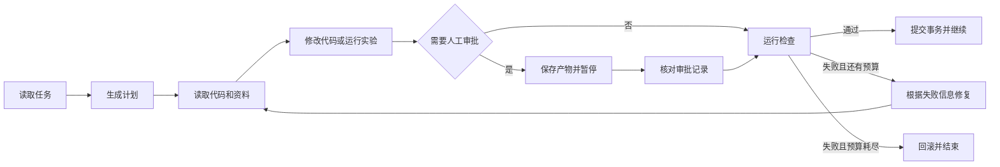

# LHA：代码任务的执行、恢复与校验

LHA 用来执行代码修改、实验和资料检索任务。它把一次任务拆成明确的步骤，
在每一步结束后运行预先登记的检查。检查通过才继续，失败结果会交给下一次
修复；进程中断后，可以从已经保存的安全位置恢复。

[](https://github.com/liuqjjin/long-horizon-agent/actions/workflows/ci.yml)


[英文说明](docs/README.en.md)

## 解决什么问题

代码任务往往不止一次模型调用。前一步产生的错误如果没有被发现，会进入后续步骤，
最后可能得到一个表面完整、实际无法运行的结果。LHA 把状态转换、预算、人工审批、
检查、修复和回滚放在执行器中，不由模型自行判断任务是否完成。

```text
读取上下文 → 执行 → 审批（可选）→ 校验 → 修复或推进 → 保存检查点
```

内部检查只决定当前运行能否继续。实验评分使用另外的执行流程，在新的仓库副本中
应用保存的源代码改动，再运行固定测试。内部判断不会直接作为实验结果。

## 快速运行

需要 Python 3.11 或更高版本，以及 [uv](https://docs.astral.sh/uv/)。

```bash
git clone https://github.com/liuqjjin/long-horizon-agent.git
cd long-horizon-agent
uv sync

# 默认使用确定性桩后端，不需要模型凭据
uv run lha run data/tasks/fix_average.yaml

# 运行仓库自测
LHA_RUNS_DIR=runs/_quickstart uv run lha eval
```

本机已经登录 Codex CLI 时，可以切换到真实模型后端：

```bash
LHA_CODEX_MODEL=gpt-5.4-mini \
LHA_CODEX_EFFORT=medium \
uv run lha --llm codex_cli run data/tasks/fix_average.yaml
```

查看一次运行保存的状态、补丁和检查结果：

```bash
RUN_ID=替换为实际运行编号
uv run lha runs show "$RUN_ID"
uv run lha trace "$RUN_ID"
uv run lha trace "$RUN_ID" --html
```

## 执行流程



## 核心实现

### 状态与恢复

- `state.json` 带 SHA-256 校验，使用 `fsync` 和原子替换写入。
- `ledger.jsonl` 只追加事件，尝试编号和幂等键用于避免重复完成。
- 步数、修复次数、运行时间和模型调用量在恢复后继续累计。
- 每个运行目录带文件锁，防止两个进程同时恢复同一个 `run_id`。
- schema-v1 状态可以查看，但不能按 schema-v2 的规则直接恢复。
- 可选的 LangGraph 运行时使用 SQLite 保存图状态，并复用同一套执行和检查代码。

### 补丁事务与审批

- 写入路径从实际 diff 或文件内容计算，不采用模型声明的文件列表。
- 默认保护测试、构建配置和 CI 文件；例外路径必须在任务中明确列出。
- 补丁按 `PREPARED`、`APPLIED`、`VERIFIED`、`REVERTED` 四个状态记录。
- 事务保存原文件备份和应用后的文件摘要；证据不一致时停止恢复。
- 人工审批绑定步骤编号和补丁文件的 SHA-256，恢复时不能替换已审核的内容。

### 检查与执行边界

- 代码任务运行 Pytest、Ruff 或仓库声明的命令。
- 实验任务从数组重新计算 PSNR、SSIM，并在新目录中复跑。
- 无法启动、没有收集到测试或所有测试都被跳过，均不计为通过。
- `trusted-local` 只适合可信仓库；外部代码应使用 Docker 后端。
- 目标仓库或模型影响的命令统一通过 `ExecutionBackend` 执行。
- 代码、论文和实验记录通过 `lha.live_context` 查询，并保存来源摘要和新鲜度。

### 固定的多文件任务

`data/long_tasks/` 包含五个固定用例，覆盖配置解析、SQLite 迁移、并发更新、
命令行输出约定和实验复现。每个用例带任务文件、仓库适配配置、参考补丁和摘要。

这些用例按十个阶段运行：完整性检查、环境准备、基线、问题复现、上下文读取、
审批后修改、定向测试、完整测试、静态检查和构建。测试覆盖补丁被拒绝后修复、
审批恢复、进程中断恢复，以及恢复前后终态一致。

## 目录结构

```text
src/lha/harness/       状态机、检查点、审批和补丁事务
src/lha/verifiers/     代码、实验和上下文检查
src/lha/sandbox/       本地与 Docker 执行后端
src/lha/runtime/       可选的 LangGraph 运行时
src/lha/live_context/  代码和文档索引入口
src/lha/bench/         消融与公开评测适配器
data/long_tasks/       固定的多文件任务
tests/                 单元、集成、恢复和打包测试
benchmarks/            生成的评测报告
```

## 评测状态

仓库保留 schema-v2 消融报告，用于追溯旧版协议和原始记录。评分隔离、
错误分类和证据保存的边界已经调整，因此这份报告不再作为当前项目结论。
当前实现使用 schema-v4；正式结果需要完整重跑，并同时提交原始记录、配置和汇总报告。

Terminal-Bench 2.1 接入通过 Harbor 运行任务和官方校验程序（verifier）。直接 Harbor 运行
评估的是该次模型执行结果，不用于证明 LHA 内部检查或修复流程的效果。正式结果
完成并提交前，本页不列公共基准分数。

评测方法见[消融说明](docs/ABLATION.md)和
[评测入口](docs/BENCHMARKS.md)。

## 已提交的实测结果

以下是历史快照（legacy），只用于核对旧协议，不作为当前版本的正式结论。
它包含 17 个预设 Python 缺陷，每个任务重复 12 次，共 204 组相同首轮补丁。

| 条件 | 处理方式 | 旧报告记录 |
|---|---|---|
| `trust` | 直接交付首轮补丁 | 194 个正确，10 个错误仍被接受 |
| `gate` | 检查后决定是否交付 | 接受 194 个正确补丁，拦截 10 个错误补丁 |
| `verify` | 检查失败后继续修复 | 204/204 通过独立评分 |

`trust` 与 `gate` 对错误交付的配对检验为 `p = 0.00195`。长任务组合曲线不增加独立样本
或观测，只是用已有单元结果做推演。采用 schema-v4 证据协议的 204 组
正式复测尚未完成；完成后会用新报告整体替换本节数字。

## 当前边界

- 当前按研究与工程验证用途维护，不作为线上服务使用。
- `trusted-local` 会清理环境和进程，但不能隔离恶意代码。
- Docker 后端的安全性仍取决于镜像、挂载、网络和资源配置。
- `LHA_DEADLINE_S` 在持久化边界检查；单次阻塞操作仍由各自的超时参数终止。
- 来源摘要和新鲜度检查不能替代可执行测试。
- 测试只能证明已覆盖的行为，不能保证补丁在所有输入上正确。
- 评测适配代码本身不代表已经取得相应基准成绩。

## 开发检查

```bash
uv run ruff check .
uv run pyright src/lha
uv run pytest -q
LHA_RUNS_DIR=runs/_release uv run lha eval
```

完整打包检查见[部署说明](docs/DEPLOY.md)，系统结构见[架构说明](docs/ARCHITECTURE.md)。

MIT 许可证。
