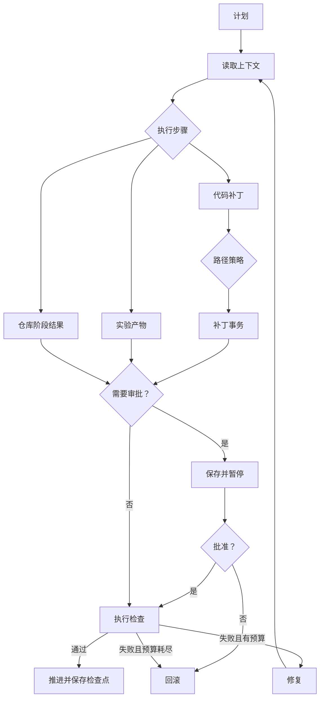
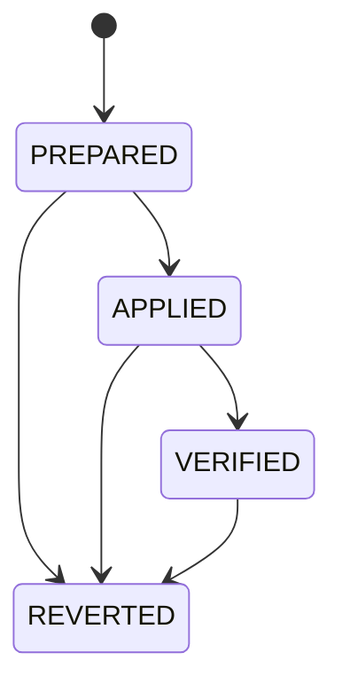

# 系统架构

LHA 是面向代码修改、实验和检索任务的状态机执行器。模型负责提出方案和产物；运行器
负责状态迁移、预算、审批、检查、恢复和回滚。

```text
plan → context → execute → [approval] → verify → repair or advance → checkpoint
```

## 模块边界

| 模块 | 职责 |
|---|---|
| `harness/` | 主循环、状态、检查点、审批、补丁事务 |
| `agents/` | 规划、上下文、实现、实验和校验代理 |
| `verifiers/` | 代码、实验和上下文检查 |
| `sandbox/` | 本地与 Docker 执行后端 |
| `live_context/` | 索引入口、状态和新鲜度判断 |
| `llm/` | 模型后端、Codex 协议解析和调用追踪 |
| `runtime/` | 可选 LangGraph 运行时 |
| `bench/` | 消融、外部基准和统计 |
| `reporting.py` | 运行记录校验、展示和清理 |

`lha.live_context` 是代码和文档索引的唯一入口。目标仓库或模型影响的命令统一通过
`ExecutionBackend`；内部门禁不能充当消融或外部基准的真值。

## 一次运行如何推进

`src/lha/harness/loop.py` 实现默认运行时：

1. 生成带类型的计划；
2. 读取上下文位置、摘要、新鲜度和不可用原因；
3. 由实现器、实验器或仓库适配器生成产物；
4. 从真实产物解析写入路径并执行策略检查；
5. 需要人工审批时，先保存产物再暂停；
6. 注册的检查器返回结构化 verdict；
7. 通过后进入下一步，失败后在预算内修复，耗尽预算则回滚；
8. 每次迁移前保存状态和事件记录。



## 状态与恢复

`RunState` schema v2 保存游标、已完成和失败步骤、稳定 attempt ID、修复次数、原始预算、
累计耗时和模型用量。恢复时若步骤上限、修复上限、deadline 或模型调用上限发生变化，
系统会拒绝继续。schema v1 记录可以查看，但不能按 schema v2 直接恢复。

这里的 **RunState schema v2 是运行检查点格式**，校验消融的
**report schema v4 是评测证据格式**。两者版本号属于不同数据模型，没有“运行状态从
v2 升级到报告 v4”的关系；Terminal-Bench 还有自己独立的证据版本。

`state.json` 放在带校验和的 envelope 中，写入过程为：

1. 写临时文件；
2. `fsync` 文件；
3. 原子替换正式文件；
4. `fsync` 目录。

`ledger.jsonl` 在逻辑上只追加事件。每次更新先验证现有事件链，再原子替换完整字节，
不依赖操作系统 `O_APPEND`。完整事件损坏会停止恢复；仅旧格式最后一条出现明确撕裂时，
才按中断写入处理。

每个运行目录都有文件锁，阻止两个进程并发恢复。attempt ID 和幂等键用于避免重复记录
审批、失败和完成事件。不能确认是否已经发生的外部副作用由预写 intent 和恢复检查处理，
不会仅凭幂等键推断为安全。

强制停止可能留下权限受限的临时文件，首次写入 write-once 证据时也可能留下不完整的
正式文件。恢复只处理与已验证事务状态精确匹配的残留；无法证明内容时停止并保留现场，
不会猜测缺失字节。

可选 LangGraph 运行时复用相同的执行和校验函数。准备、审批中断和验证是不同节点，
SQLite 只保存图检查点，不能在恢复时替换已经审批的补丁。

## 补丁事务

`ResolvedPatch` 从 diff 或文件内容计算唯一写入集合，不信任模型声明的
`touched_files`。路径策略、备份、应用、审批、产物清单、检查和回滚使用同一集合。



进入 `PREPARED` 前，补丁、清单、原文件数据、冗余备份和事务日志都必须已经持久化。
恢复按已记录状态处理：

- `PREPARED`：先确认或恢复原状态，再应用同一补丁；
- `APPLIED` / `VERIFIED`：校验当前文件摘要，不重复应用；
- `REVERTED`：不再次执行该 attempt；
- 证据缺失、矛盾或备份损坏：停止恢复。

备份保存文件字节、权限和补丁创建的目录。路径穿越、符号链接写入和受保护文件修改会
被拒绝。审批记录绑定 step ID 和 `patch.json` 的 SHA-256；拒绝、摘要不匹配或审批
证据损坏都会触发回滚。

## 仓库阶段

`src/lha/repo_adapter.py` 用带类型的参数向量描述仓库命令，不接受任意 shell 字符串。
`data/long_tasks/` 中五个固定多文件任务分别覆盖配置优先级、SQLite 迁移、并发更新、
CLI 契约和实验复现。

每个任务按十个阶段执行：

```text
integrity → setup → baseline → reproduce → context → approved edit
          → targeted tests → full tests → lint → build
```

阶段执行前先保存 intent，完成后再保存结果。如果进程可能已经产生副作用、但完成证据
尚未写入，恢复会停止，而不是重复执行可能不幂等的命令。

仓库适配器只定义准备和检查方式。没有固定协议、原始结果、来源信息和提交后的汇总，
它本身不构成基准成绩。

## 持久化产物

边界数据使用 Pydantic，内部辅助值使用 dataclass。常见文件包括：

| 产物 | 路径示例 |
|---|---|
| 计划 | `plan.json` |
| 上下文 | `steps/<step>/context_bundle.json` |
| 补丁 | `steps/<step>/attempts/<attempt>/patch.json` |
| 事务证据 | `steps/`、`backups/`、`transactions/` |
| 实验结果 | `steps/<step>/experiment.json` |
| 仓库阶段 | `steps/<step>/repo_stage.json` |
| 检查结果 | `steps/<step>/verify.json` |
| 模型调用 | `llm_trace.jsonl` |

运行根目录保留指向最新产物的兼容文件；按步骤和 attempt 保存的文件构成完整历史。

## 校验

未知检查器、空检查集合、检查进程崩溃或命令无法启动都返回失败。

| 类型 | 主要检查 | 证据 |
|---|---|---|
| 代码 | Pytest、Ruff、仓库阶段 | 子进程结果 |
| 实验 | PSNR、SSIM、复现 | 数组、摘要、全新目录复跑 |
| 上下文 | 新鲜度、引用 | 来源摘要、状态、定位信息 |

实验结果绑定路径、形状、数据类型、数组摘要和输入摘要。复跑使用新目录，并拒绝缺失、
过期、非有限或不匹配的数组。

上下文状态区分 `ok`、`empty`、`backend_unavailable` 和 `index_failed`，同时保存部分
可用情况和失败原因。任务声明上下文必需时，没有可用证据就不能继续。

## 模型和执行后端

Codex CLI 后端为每次调用创建独立 home、`CODEX_HOME`、工作区和临时目录，只传递允许
的环境变量，并在子进程停止后清理临时认证。非法 JSONL、未知或错误事件、未结束 turn、
缺少完成消息以及不允许的工具调用都会失败。成功记录包含 CLI、模型、推理强度、事件
计数、用量和结果，不包含凭据。

| 执行后端 | 用途 |
|---|---|
| `trusted-local` | 用户信任的开发仓库 |
| `docker` | 外部仓库和独立消融评分 |

本地后端会收敛环境变量、设置资源限制并管理进程组，但不是安全沙箱。Docker 后端断网、
使用只读根文件系统、非 root UID、资源上限、capability 清理和
`no-new-privileges`；目标工作区仍按任务需要挂载为可写。

## 评测与报告

正式消融会在提交中固定源码、语料、模型、CLI/client 参数、Docker 镜像 ID、输出目录
和用于留下开始记录的一次性远端 Git 引用。`scorer_runtime_sha256` 另外绑定
`pyproject.toml`、`uv.lock`、
`.python-version`、`Dockerfile` 与 `.dockerignore`；重建相同输入不能重新开放已经
消耗的实验选择。正式单元不读缓存，运行中断后写 `ABANDONED`，不能恢复。只有完整
报告及 `COMPLETED` 事件可以成为当前证据。

`lha horizon` 把配对单元、按重复序号从已测单元构造的完整语料聚合和组合推演分开。
schema v4 的单元推断按任务聚类，重复单元不会被当作独立样本；聚合级比较使用完整重复
作为配对单位。这里的聚合不是实际执行的共享状态长任务，组合推演也不增加样本。外部
Terminal-Bench 适配器直接调用模型，不经过 LHA 门禁，因此其成绩不能证明门禁或修复能力。

`src/lha/reporting.py` 在展示或删除前验证运行证据。`lha runs prune` 默认只预览，
并拒绝清理活动中、加锁、未完成或损坏的运行。

实验协议见 [校验消融](ABLATION.md) 和 [评测说明](BENCHMARKS.md)，发布门禁见
[构建与发布检查](DEPLOY.md)。
