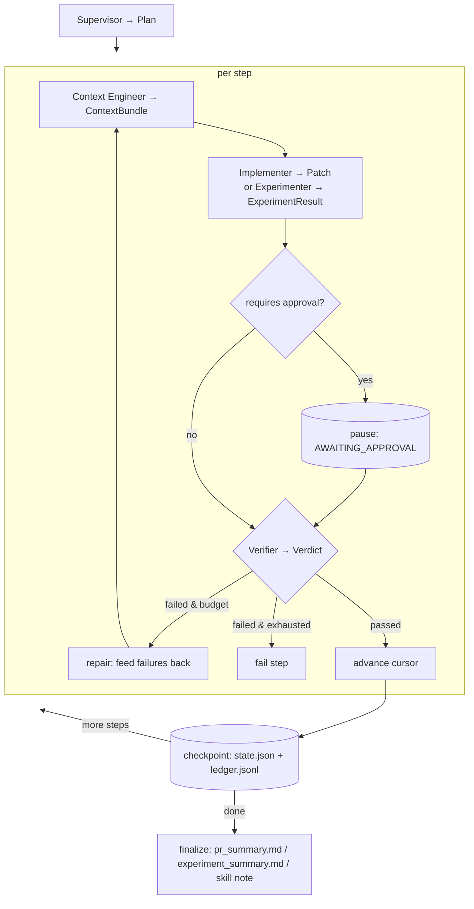
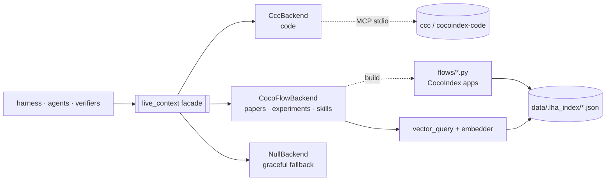

# Architecture

A small, readable core. One spine (the verification loop), one door to indexed
context (the facade), three verifier families behind one interface, and an opt-in
durable runtime. Everything else composes those.

## The spine — the verification loop

`src/lha/harness/loop.py` drives, for each step of a plan:

```
context → execute → [approval gate] → verify → (repair | advance) → checkpoint → repeat
```

- **Budget.** `max_steps`, `max_repairs`, optional wall-clock — the loop always terminates.
- **Checkpoint/resume.** Each step writes `runs/<id>/state.json` (atomic) and appends
  `ledger.jsonl`. `lha resume <id>` re-enters at the saved cursor; a fresh process
  resumes because patch backups are persisted to disk.
- **Approval gate.** A step may require human approval before its result is accepted
  (`AWAITING_APPROVAL` → `lha approve|reject` → `lha resume`).



## Structured artifacts (not chat)

Each role emits a typed pydantic artifact, persisted under `runs/<id>/`:

| Role | Artifact | File |
|------|----------|------|
| Supervisor | `Plan` (steps, success criteria, chosen verifiers) | `plan.json` |
| Context Engineer | `ContextBundle` (items + provenance + freshness) | `context_bundle.json` |
| Implementer | `Patch` (unified diff / file contents + rationale) | `patch.diff`, `patch.json` |
| Experimenter | `ExperimentResult` (command, metrics, output paths) | `experiment.json` |
| Verifier | `Verdict` (per-check results, env) | `verify.json` |

Definitions live in `src/lha/artifacts.py` and `src/lha/verifiers/verdict.py`.

## The live-context facade

The **only** way the rest of the system reaches indexed context is
`src/lha/live_context/` (imported as `lha.live_context`):

```
search_code · search_papers · search_experiments · search_skills · get_fresh_context · reject_stale
```

Behind it, swappable backends do the real work; nothing outside the facade imports
CocoIndex or calls `ccc`. The boundary is enforced by a grep (run it locally / in CI):

```bash
grep -rnE "^[[:space:]]*(import|from)[[:space:]]+(cocoindex|cocoindex_code)" \
  --include='*.py' src/lha | grep -v "src/lha/live_context/"   # must be empty
```



- **Code** (`backends/ccc_backend.py`): talks to `ccc mcp`'s structured `search` tool
  over stdio — the only supported structured surface (`ccc search` has no JSON API).
- **Papers / experiments / skills** (`backends/coco_flow.py` + `flows/`): CocoIndex
  flows (`@coco.fn(memo=True)`, incremental) embed markdown notes to local JSON; the
  query path is a dependency-light numpy cosine search (`backends/vector_query.py`).
- **Freshness** (`live_context/freshness.py`): compares source mtime / content hash
  against index-generation time; `reject_stale` triggers an incremental reindex.

## Three verifier families

`src/lha/verifiers/` — one `Verifier` interface, a registry, and `select_verifiers(step)`:

| Family | Verifiers | Oracle |
|--------|-----------|--------|
| code | `pytest`, `ruff` | a real test run + lint on the patched sandbox |
| experiment | `psnr`, `ssim`, `reproducibility` | metrics **recomputed** from output (scikit-image) + a re-run |
| context | `freshness`, `citation` | index-vs-source freshness; every claim resolves to a source |

A verifier that *cannot* run its check returns a failing `Check` — "couldn't verify"
never reads as "verified". PSNR is one member among many; the core has no
metric-specific assumptions.

## Agent team

Four small, focused roles plus an experiment executor, each emitting one artifact
(`src/lha/agents/`): **Supervisor** (plan), **Context Engineer** (gather), **Implementer**
(code edits) / **Experimenter** (run experiments), **Verifier Agent** (aggregate the
selected verifiers — concurrently, order-preserving). For independent tasks,
`orchestrator.py` fans out to **process-isolated** workers (`lha batch`), since the
facade is a process-global singleton.

## Durable runtime (opt-in)

`src/lha/runtime/langgraph_runner.py` runs the same plan/agents/verifiers through a
LangGraph `StateGraph` checkpointed by `SqliteSaver` (`runs/<id>/graph.sqlite`), with
`interrupt()` / `Command(resume=...)` for the approval gate. It reuses the Harness's
execute/finalize helpers, so there is one implementation of the actual work. Enable
with `lha run --runtime langgraph`.

## Skill memory (Voyager-lite)

After a verified-`DONE` run, `src/lha/memory.py` distills the success to a markdown
note under `data/skills/`; `index_docs` indexes it (`kind="skill"`) and the Context
Engineer retrieves relevant skills as additional context for future tasks. Only
verified successes are recorded.

## Module map

```
src/lha/
  harness/        loop · state · checkpoint · budget · approval · errors
  live_context/   facade + models + freshness + backends/ (the only door to indexers)
  agents/         supervisor · context_engineer · implementer · experimenter · verifier_agent
  verifiers/      base · registry · verdict · code/ · experiment/ · context/
  llm/            base · stub · claude_cli · anthropic   (one interface)
  runtime/        langgraph_runner   (opt-in durable execution)
  tasks/ tools/   task specs · sandbox patch/shell helpers
  memory.py  orchestrator.py  eval.py  cli.py  config.py
flows/            papers · experiments · skills CocoIndex apps (imported only by coco_flow)
data/             sample repo (toy bug) · paper note · experiment log · experiment script · tasks
runs/<id>/        state.json · ledger.jsonl · plan · patch · verify.json · summaries · graph.sqlite · workdir/
```
