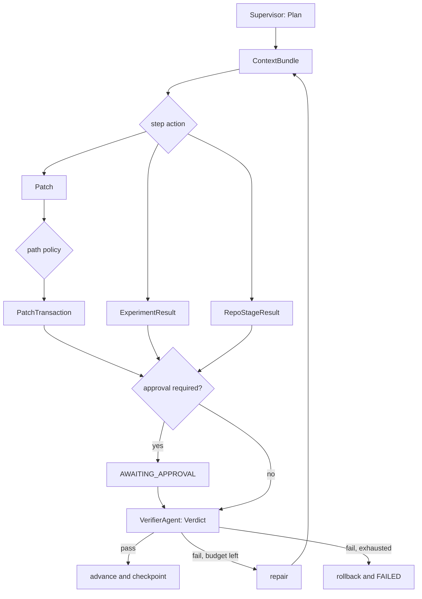
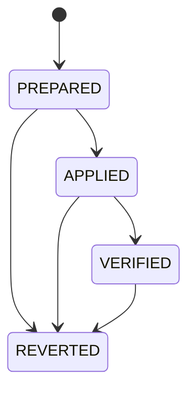
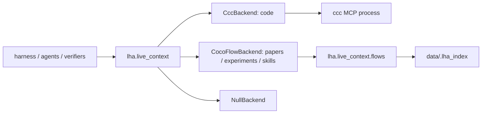

# Architecture

LHA is a state-machine runner with executable checks. The model proposes work;
the harness owns state transitions, persistence, policy, approval, verification,
and rollback.

## One run

```text
plan → context → execute → [approval] → verify → repair or advance → checkpoint
```

`src/lha/harness/loop.py` implements the default runtime:

1. The Supervisor selects a typed `Plan`.
2. The Context Engineer returns a `ContextBundle` with source locators, digests,
   freshness, status, and unavailable reasons.
3. The Implementer returns a `Patch`, the Experimenter returns an
   `ExperimentResult`, or a `RepoAdapter` runs a declared repository stage.
4. A protected-path policy checks the write set computed from the actual patch.
5. An optional approval pauses the run and binds the decision to the reviewed
   `patch.json` bytes.
6. Registered verifiers return one `Verdict`.
7. Passing work advances; failing work enters a bounded repair attempt or is
   rolled back.
8. State and ledger evidence are written before the next step begins.



## State, ledger, and locks

`RunState` schema v2 persists the cursor, completed and failed steps, repair
counters, stable attempt IDs, elapsed time, consumed steps, and model usage.
`state.json` is a checksummed envelope written with `fsync` and atomic
replacement. `ledger.jsonl` is append-only; a torn non-newline-terminated tail is
treated as an interrupted write, while corruption in durable records fails.

Every run has a file lock. A second process cannot resume the same `run_id`
concurrently. Ledger records carry attempt IDs and idempotency keys so recovery
does not duplicate approval or completion events. Schema-v1 runs can be inspected
but are not resumed as schema v2.

## Patch transaction

Patch handling is a transaction rather than a sequence of unrelated file writes.



`ResolvedPatch` computes one canonical write set from the unified diff or direct
file contents. Policy checks, backups, the artifact manifest, application,
approval, verification, and rollback all consume that same set. The patch,
manifest, primary backup, redundant backup, and transaction journal are durable
before `PREPARED` is recorded.

Recovery behavior depends on evidence:

- `PREPARED`: restore the known pre-apply state, then apply the same patch bytes;
- `APPLIED` or `VERIFIED`: validate the recorded worktree hashes instead of
  applying again;
- `REVERTED`: never apply the attempt again;
- missing, contradictory, or damaged evidence: fail closed and preserve or
  restore the last trustworthy state.

Backups retain original bytes, file modes, and directories created by a patch.
Rollback rejects path traversal and writes through symbolic links.

## Human approval

An approval names the step and SHA-256 of the exact persisted `patch.json`.
Resume checks that hash before using the artifact. Rejection, hash mismatch, or
artifact corruption rolls the change back.

`src/lha/runtime/langgraph_runner.py` drives the same helpers through a LangGraph
`StateGraph` and `SqliteSaver`. Prepare, interrupt, and verify are separate nodes:
the patch is checkpointed before `interrupt()`, so resume cannot regenerate work
after a person reviewed it.

## Long repository tasks

`src/lha/repo_adapter.py` provides typed repository stages. Commands are declared
as argument vectors and executed through an `ExecutionBackend`; arbitrary shell
strings are not accepted.

Five fixed cases live under `data/long_tasks/`: configuration parsing, SQLite
migration, concurrency failure, CLI contracts, and experiment reproducibility.
Each has immutable repository/reference digests and a 10-step plan:

```text
integrity → setup → baseline → reproduce → context → approved edit
          → targeted tests → full tests → lint → build
```

The test protocol includes a failing first patch, repair, approval resume,
process interruption at a safe boundary, and comparison with an uninterrupted
run. Repository stages write intent before execution and completion evidence
afterward. If a stage may have run but completion is missing, recovery refuses to
repeat a possibly non-idempotent side effect.

## Structured artifacts

Boundary data uses Pydantic models. Major persisted artifacts include:

| producer | artifact | typical path |
|---|---|---|
| Supervisor | `Plan` | `plan.json` |
| Context Engineer | `ContextBundle` | `steps/<step>/context_bundle.json` |
| Implementer | `Patch` | `steps/<step>/attempts/<attempt>/patch.json` |
| patch layer | manifest, backups, transaction journal | `steps/`, `backups/`, `transactions/` |
| Experimenter | `ExperimentResult` | `steps/<step>/experiment.json` |
| RepoAdapter | `RepoStageResult` | `steps/<step>/repo_stage.json` |
| VerifierAgent | `Verdict` | `steps/<step>/verify.json` |
| LLM tracing | usage and call records | `state.json`, `llm_trace.jsonl` |

Flat compatibility files at the run root point readers to the latest applicable
artifact; per-step and per-attempt paths preserve the full history.

## Verification families

`select_verifiers(step)` resolves names through the registry. An unknown
verifier, empty verifier set, crashing verifier, or unusable subprocess produces
a failing check.

| family | checks | evidence |
|---|---|---|
| code | pytest, Ruff, repository stages | actual command result |
| experiment | PSNR, SSIM, reproducibility | recomputed arrays and fresh rerun |
| context | freshness, citation | source digests, index status, locators |

Experiment artifacts bind array path, shape, dtype, SHA-256, input digest, and
metrics. Reproducibility runs in a fresh directory and rejects old files,
missing arrays, non-finite values, and digest mismatches.

Context status distinguishes `ok`, `empty`, `backend_unavailable`, and
`index_failed`; unavailable kinds and reasons survive partial success. Required
context fails closed.

## Indexed-context facade

All indexed context passes through `src/lha/live_context/`:

```text
search_code · search_papers · search_experiments · search_skills
get_fresh_context · reject_stale
```



Nothing outside this package may import `cocoindex` or `cocoindex_code`, or
invoke `ccc`. CI enforces the boundary with both tests and a source scan.

## LLM backends and Codex isolation

LLM calls go through one interface and `TracedLLM`. The deterministic stub is
used for hermetic tests and self-eval; Claude CLI, Codex CLI, and the Anthropic
SDK are optional execution paths.

The Codex CLI backend creates an attempt-local `HOME`, `CODEX_HOME`, temporary
directory, and empty workspace. It copies only the authentication material the
CLI requires and passes a small environment allowlist, not the caller's secrets.
The CLI runs in a new process group; timeout, failure, or interruption terminates
descendants before temporary credentials are removed.

Its JSONL protocol is strict. Invalid JSON, unknown event types, error events,
an incomplete turn, or unfinished/disallowed tool use fails the call. Successful
metadata includes CLI version, configured model and reasoning effort, event
summary, usage, and outcome.

## Execution boundary

Target or model-influenced commands use `lha.sandbox.ExecutionBackend`.

| backend | controls | intended use |
|---|---|---|
| `trusted-local` | small environment, process-group cleanup, optional limits | trusted repository development and self-eval |
| `docker` | no network, empty environment, resource limits, read-only source mounts | external repositories and independent scoring |

`trusted-local` is not a hostile-code sandbox. The Docker backend image must
contain every command the task declares; the default slim Python image does not
include pytest or Ruff.

## Ablation and horizon analysis

`lha ablate` draws one first attempt per `(task, repetition)` and evaluates that
attempt under `trust`, `gate`, and `verify`. The gate's acceptance is a
prediction. Truth is obtained by freezing the effective source change, applying
it to a fresh canonical copy with original tests, and running a separate scorer
backend. Error cells remain visible, are not cached, and are excluded from rate
estimation.

`lha horizon` reports three estimands:

1. paired task/repetition cells;
2. paired complete-corpus repetitions;
3. a descriptive composition over empirical per-task rates.

The cell and episode McNemar tests use different units and may have different
p-values. Composition adds zero observations and has no McNemar p-value. Wilson
intervals are used for boundary proportions.

## Reports and retention

`src/lha/reporting.py` validates a run before displaying or deleting it.

```bash
uv run lha trace <run_id>
uv run lha trace <run_id> --html
uv run lha runs list
uv run lha runs show <run_id>
uv run lha runs prune --older-than-days 30
```

The static HTML report includes the step timeline, patches, approval history,
verdicts, repair events, and model usage. Persisted checksummed totals are
authoritative when the optional trace is incomplete. Pruning is a dry run by
default and can delete only unlocked, validated, terminal runs.

## Module map

```text
src/lha/
  harness/        loop · state · checkpoint · approval · manifest · transaction
  live_context/   facade · models · freshness · backends · packaged flows
  agents/         supervisor · context_engineer · implementer · experimenter · verifier_agent
  verifiers/      base · registry · verdict · code/ · experiment/ · context/
  llm/            base · stub · claude_cli · codex_cli · anthropic_client · trace
  sandbox/        ExecutionBackend · trusted_local · docker
  runtime/        langgraph_runner
  bench/          swebench · terminal_bench · stats
  tasks/ tools/   task specs · patch resolution · policy · shell
  reporting.py    run inspection, HTML, retention
  repo_adapter.py typed long-task stages and evidence
data/long_tasks/  five fixed multi-file cases
runs/<id>/        state · ledger · transactions · artifacts · worktree · reports
```
