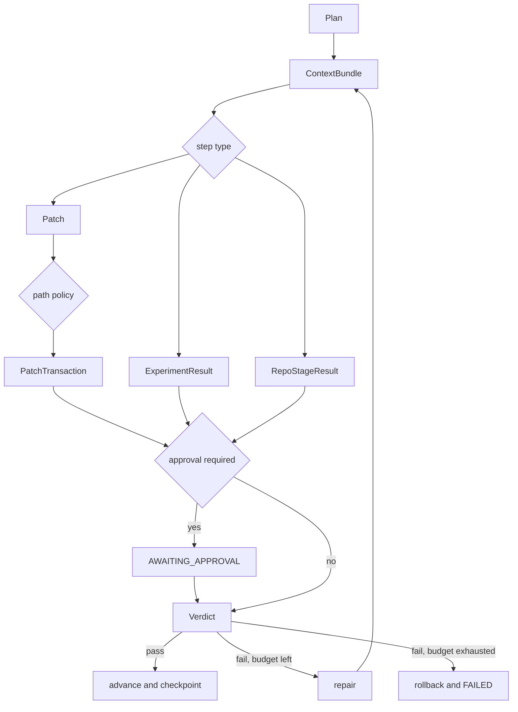
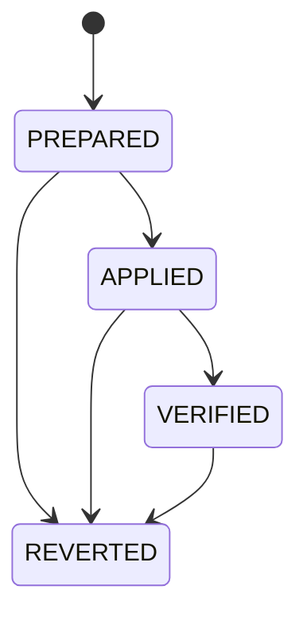

# Architecture

LHA is a state-machine runner for code changes, experiments, and
retrieval-backed tasks. The model proposes work. The runner owns state
transitions, budgets, approval, checks, recovery, and rollback.

## Run lifecycle

```text
plan → context → execute → [approval] → verify → repair or advance → checkpoint
```

`src/lha/harness/loop.py` implements the default runtime:

1. the supervisor creates a typed plan;
2. the context component returns source locators, digests, freshness, and
   unavailable reasons;
3. an implementer, experiment runner, or repository adapter produces an
   artifact;
4. the path policy checks the write set computed from that artifact;
5. optional approval pauses the run after the artifact is saved;
6. registered verifiers return a verdict;
7. passing work advances, while failing work is repaired within budget or
   rolled back;
8. state and ledger records are saved before the next step begins.



## State and recovery

`RunState` schema v2 stores the cursor, completed and failed steps, stable
attempt IDs, repair counters, elapsed time, original budgets, and model usage.
Resume rejects changes to the saved step, repair, deadline, or model-call
limits.

`state.json` is stored in a checksummed envelope and replaced atomically after
`fsync`. `ledger.jsonl` is logically append-only: each update validates the
event chain and atomically replaces the complete bytes. It does not depend on
`O_APPEND`. A torn legacy final record is treated as an interrupted write;
corruption in a complete record stops recovery.

Each run has a file lock. Attempt IDs and ledger idempotency keys prevent
duplicate approval and completion events. Schema-v1 state can be inspected but
is not resumed as schema v2.

Atomic replacement writes a temporary file, syncs it, renames it, and syncs the
directory. A forced stop can leave a restrictive temporary file. Transaction
recovery removes only an exact temporary file that matches a validated journal
transition; ambiguous residue stops recovery.

Write-once evidence uses exclusive creation at its final name. A forced stop or
storage failure during that first write can leave incomplete bytes. Loaders
reject the mismatch; they do not infer or reconstruct the missing content.

The optional LangGraph runtime uses the same execution and verification helpers.
Its prepare, approval interrupt, and verify steps are separate nodes backed by
SQLite, so resume cannot regenerate a patch after review.

## Patch transaction

`ResolvedPatch` derives one canonical write set from the actual diff or file
contents. Policy checks, backup, apply, approval, manifest, verification, and
rollback all use that set.



The patch, manifest, original file data, redundant backup, and transaction
journal are durable before `PREPARED` is recorded. Recovery follows the saved
state:

- `PREPARED`: restore the known original state, then apply the same patch;
- `APPLIED` or `VERIFIED`: validate recorded file hashes instead of applying
  again;
- `REVERTED`: do not apply the attempt again;
- missing or contradictory evidence: stop and preserve the last state that can
  be verified.

Backups retain bytes, file modes, and directories created by a patch. Path
traversal and writes through symbolic links are rejected.

Approval names the step and SHA-256 of the exact `patch.json`. Rejection, hash
mismatch, or damaged evidence causes rollback.

## Repository stages

`src/lha/repo_adapter.py` provides typed stages whose commands are argument
vectors, not arbitrary shell strings. The five fixed fixtures under
`data/long_tasks/` cover configuration parsing, SQLite migration, concurrent
updates, CLI contracts, and experiment reproduction.

Each fixture follows ten stages:

```text
integrity → setup → baseline → reproduce → context → approved edit
          → targeted tests → full tests → lint → build
```

A stage writes intent before execution and completion evidence afterward. If a
process exits after a stage may have run but before completion is saved, resume
does not repeat a potentially non-idempotent side effect.

These adapters define how a fixed repository is prepared and checked. They do
not by themselves establish a benchmark result; that also requires a fixed
protocol, raw outcomes, provenance, and a committed summary.

## Persisted artifacts

Boundary data uses Pydantic models. The main files are:

| artifact | typical path |
|---|---|
| plan | `plan.json` |
| context | `steps/<step>/context_bundle.json` |
| patch | `steps/<step>/attempts/<attempt>/patch.json` |
| transaction evidence | `steps/`, `backups/`, `transactions/` |
| experiment result | `steps/<step>/experiment.json` |
| repository stage result | `steps/<step>/repo_stage.json` |
| verifier result | `steps/<step>/verify.json` |
| model trace | `llm_trace.jsonl` |

Compatibility files at the run root point to the latest applicable artifact;
per-step and per-attempt files retain the full history.

## Verification

Unknown verifiers, an empty verifier set, crashed checks, and unusable
subprocesses all produce a failing result.

| family | checks | evidence |
|---|---|---|
| code | Pytest, Ruff, repository stages | subprocess result |
| experiment | PSNR, SSIM, reproducibility | arrays, hashes, fresh rerun |
| context | freshness, citations | source digests, status, locators |

Experiment evidence binds paths, shapes, data types, hashes, and input digests.
Fresh reruns reject missing, stale, non-finite, or mismatched arrays.

Context distinguishes `ok`, `empty`, `backend_unavailable`, and `index_failed`.
Partial availability and failure reasons are retained. Required context does
not pass when usable evidence is missing.

## Context and model backends

All indexed context goes through `src/lha/live_context/`. No other package may
import CocoIndex or start `ccc`. CI checks this boundary.

LLM calls use one interface and a tracing wrapper. The Codex CLI backend creates
an attempt-local home, `CODEX_HOME`, workspace, and temporary directory. It
passes a small environment allowlist, runs the CLI in a new process group, and
removes temporary credentials after descendants have stopped on normal return,
failure, timeout, or handled interruption. `SIGKILL`, a kernel crash, or power
loss can bypass cleanup and leave a mode-protected directory for manual review.

Malformed JSONL, unknown events, error events, incomplete turns, and unfinished
or disallowed tool use fail the call. Successful records include CLI version,
model, reasoning effort, event counts, usage, and outcome, but not credentials.

## Execution backends

Target- or model-influenced commands use `ExecutionBackend`.

| backend | intended use |
|---|---|
| `trusted-local` | trusted development repositories |
| `docker` | external repositories and the separate ablation scoring path |

The local backend limits inherited environment and manages process groups, but
it is not a security sandbox: target code retains the current user's host
permissions. The Docker backend disables network access,
clears the environment, applies resource limits, and mounts source read-only
where the task permits. Its image must contain every command declared by the
task.

## Evaluation and reporting

The ablation gate is a prediction, not the reported benchmark result. The
scoring path applies a frozen change to a fresh repository and runs a separate
scorer. `lha horizon` reports paired cells, complete repetitions, and
descriptive composition as different quantities; composition adds no
observations.

The formal ablation path fixes its source, corpus, model, CLI and client
configuration, Docker image, output path, and witness remote in a committed
registration. At startup it creates a new remote Git ref bound to the run
header. Formal cells do not read cache, and an interrupted formal attempt is
recorded as abandoned rather than resumed. These rules apply only to the formal
17-task × 12-repetition schedule; exploratory runs may use cache.

`src/lha/reporting.py` validates persisted evidence before showing or deleting a
run. `lha runs prune` is a dry run by default and refuses active, locked,
unfinished, or corrupt runs.

See [ABLATION.md](ABLATION.md), [HORIZON.md](HORIZON.md), and
[DEPLOY.md](DEPLOY.md) for the corresponding protocols.
